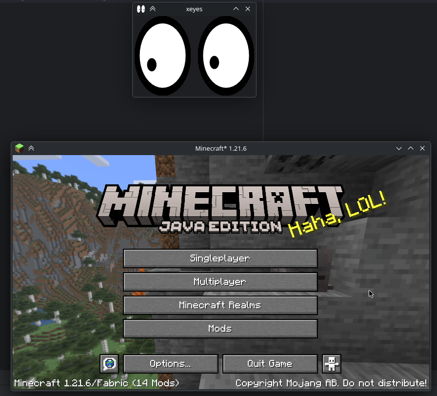

# WayMoreIcons
Simple mod that adds support for setting the window icon when running under Wayland.

## Elysium branch
At the request of Fyoncle, this is a custom version that shows the ED icon and removes the config screen.
### Changes:
- gradle.properties: version is appended with `-elysium`
- fabric.mod.json: references to modmenu and cloth config are removed
- dev.blucobalt.waymoreicons.WayMoreIcons: cloth config initialization is removed, the config is made immutable, and the logic to change icon size is removed
- assets/waymoreicons/icons: everything else is removed, leaving only the 256x256 ED icon

## Note
Icon assets were retrieved from the following sources:
 
https://mcasset.cloud/1.21.6/assets/icons/
 
https://mcasset.cloud/1.17.1/assets/icons/

## License
Copyright (c) 2025 blucobalt <luke@blucobalt.dev>

This program is free software: you can redistribute it and/or modify
it under the terms of the GNU Lesser General Public License as published by
the Free Software Foundation, either version 3 of the License, or
(at your option) any later version.

This program is distributed in the hope that it will be useful,
but WITHOUT ANY WARRANTY; without even the implied warranty of
MERCHANTABILITY or FITNESS FOR A PARTICULAR PURPOSE.  See the
GNU General Public License for more details.

You should have received a copy of the GNU Lesser General Public License
and a copy of GNU General Public License along with this program.  If not, see
<http://www.gnu.org/licenses/>
You should have received a copy of the GNU Lesser General Public License
along with realmsfix.  If not, see <http://www.gnu.org/licenses/>.

## Modpacks / etc
Feel free to use this mod in any way, as long as you give credit and follow the license above. This could mean linking to the Modrinth page, or something among those lines.
 
Or don't! You have free will. (But I would appreciate it if you did.)
